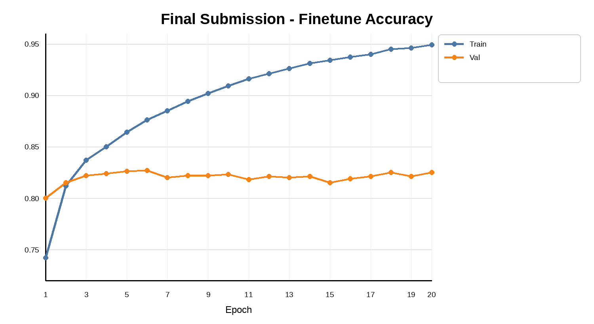
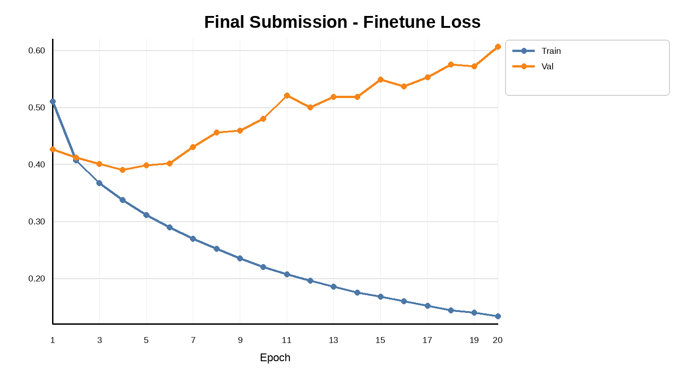

# mini GPT 구현 과제 보고서

## 0. 반·팀원

| 항목 | 내용 |
| --- | --- |
| 반 | 301호 |
| 팀명 | 2팀 |
| 팀원 | 김민철 |
| 팀원 | 남동현 |
| 팀원 | 박승현 |
| 팀원 | 김세민 |

---

## 1. 구현 현황

| 단계 | 구현 내용 | 구현 파일 | 담당자 |
| --- | --- | --- | --- |
| 1 | UTF-8 byte-level BPE tokenizer 구현, vocab 저장/로드, encode/decode | `src/bpe.py` | 공동 |
| 2 | GPTDataset, create_dataloader, token/position embedding | `src/dataset.py`, `src/embeddings.py` | 공동 |
| 3 | MultiHeadAttention, causal mask, attention dropout | `src/attention.py` | 공동 |
| 4 | LayerNorm, GELU, FeedForward, TransformerBlock, GPTModel, generate_text_simple | `src/model.py` | 공동 |
| 5 | loss 계산, evaluation, checkpoint 저장/로드, text generation, train_model | `src/train.py` | 공동 |
| 6 | NSMC 감성 분류 Dataset, GPT 기반 sequence classifier, train/evaluate 함수 | `src/finetune.py` | 공동 |
| 7 | BPE/pretrain/finetune 자동 실험 파이프라인 및 그래프 생성 | `submit_full_pipeline.py`, `auto_cpu_pipeline.py` | 공동 |

---

## 2. 테스트 통과 현황

아래 단위 테스트를 실행하여 전체 테스트가 통과하는 것을 확인했다.

| 실행 명령 | 결과 | 비고 |
| --- | --- | --- |
| `pytest tests/test_bpe.py -v` | 통과 | BPE tokenizer 관련 테스트 통과 |
| `pytest tests/test_dataset.py -v` | 통과 | Dataset, dataloader, embedding 관련 테스트 통과 |
| `pytest tests/test_attention.py -v` | 통과 | MultiHeadAttention, causal mask 관련 테스트 통과 |
| `pytest tests/test_model.py -v` | 통과 | GPTModel, TransformerBlock, generation 관련 테스트 통과 |
| `pytest tests/test_train.py -v` | 통과 | loss 계산, checkpoint, train utility 관련 테스트 통과 |
| `pytest tests/test_finetune.py -v` | 통과 | sentiment dataset, classifier, train/eval 함수 테스트 통과 |
| `pytest tests/ -v` | 통과 | 전체 테스트 통과 |

실험 자체는 로컬 GPU 환경에서 정상적으로 진행되었고, BPE 생성, pretrain, finetuning, checkpoint 저장, history CSV 및 plot 생성까지 완료되었다.

---

## 3. 데이터

| 항목 | 내용 |
| --- | --- |
| 원본 데이터 | NSMC 영화 리뷰 데이터 |
| 원본 경로 | `data/ratings_train.txt`, `data/ratings_test.txt` |
| 사전 학습 데이터 | `data/nsmc_lm_train.txt`, `data/nsmc_lm_val.txt` |
| 미세 조정 데이터 | `data/nsmc_sentiment_train.jsonl`, `data/nsmc_sentiment_val.jsonl`, `data/nsmc_sentiment_test.jsonl` |
| 전처리 방식 | 빈 리뷰 제거, 공백 정리, train/validation 분리, BPE tokenizer로 token id 변환 |
| 사용한 데이터 크기 | 제출 기준 실험에서는 BPE 학습에 `corpus[:1_500_000]` 사용, final pretrain/finetune은 전체 학습 데이터 사용 |

---

## 4. BPE

| 항목 | 내용 |
| --- | --- |
| 구현 파일 | `src/bpe.py` |
| BPE 방식 | UTF-8 byte-level BPE |
| 특수 토큰 ID | `<pad>=0`, `<unk>=1`, `<bos>=2`, `<eos>=3` |
| byte token ID 범위 | 4~259 |
| vocab_size | 3000 |
| 학습 corpus 크기 | `corpus[:1_500_000]` |
| 어휘 학습 시간 | BPE/token encode는 CPU 중심 작업으로 수행 |
| vocabulary 저장 경로 | `runs/submit_full_v3000_1500k_ctx128` 하위 cache 및 결과 디렉터리 |
| 인코딩/디코딩 복원 예시 | byte-level 기반이므로 `decode(encode("이 영화는 좋았다"))` 형태로 원문 복원 가능 |

초기에는 `vocab_size`와 `tokenizer_train_chars`를 여러 조합으로 비교했지만, 최종 보고서에서는 제출 기준에 맞춰 `vocab_size=3000`, `tokenizer_train_chars=1_500_000`, `context_length=128`을 고정했다. BPE 후보 비교는 단순 token-level loss가 아니라 token 수 차이를 고려한 `val_total_nll = final_val_loss * val_tokens`를 참고했다.

---

## 5. 모델 구조

| 항목 | 내용 |
| --- | --- |
| 구현 파일 | `src/model.py` |
| 전체 구조 | InputEmbedding -> N x TransformerBlock -> LayerNorm -> LM head |
| vocab_size | 3000 |
| context_length | 128 |
| emb_dim | 64 |
| n_heads | 4 |
| n_layers | 2 |
| drop_rate | 0.1 |
| qkv_bias | False |
| 총 파라미터 수 | 약 2,065,536개 |

최종 제출 기준 pretrain 모델은 `emb_dim=192`, `n_heads=6`, `n_layers=2` 구조를 사용했다. `emb_dim=128`보다 `emb_dim=192`가 validation loss를 더 낮췄기 때문에, 영화 리뷰 문장의 표현을 담기 위해 embedding 차원을 키우는 것이 효과적이었다.

---

## 6. 사전 학습

### 6.1 하이퍼파라미터

| 구분 | 항목 | 값 |
| --- | --- | --- |
| 모델 | vocab_size | 3000 |
| 모델 | context_length | 128 |
| 모델 | emb_dim | 64 |
| 모델 | n_heads | 4 |
| 모델 | n_layers | 2 |
| 모델 | drop_rate | 0.1 |
| 학습 | batch_size | 4 |
| 학습 | num_epochs | 20 |
| 학습 | 평가 방식 | epoch마다 train loss / validation loss 기록 |
| 최적화 | lr | 1e-4 |
| 최적화 | weight_decay | 사용하지 않음 또는 기본값 |

### 6.2 Pretrain Sweep 요약

제출 기준인 `vocab_size=3000`, `tokenizer_train_chars=1_500_000`, `context_length=128`을 고정하고 pretrain 후보를 5 epoch씩 짧게 비교했다. 핵심 비교 대상은 learning rate와 embedding dimension이었다.

| 선택된 후보 | best_val_loss | 선택 이유 |
| --- | ---: | --- |
| `pt_lr1e4_emb64` | 5.8116 | 비교 후보 중 validation loss가 가장 낮았고, `lr=1e-4`, `emb_dim=64` 조합이 가장 안정적으로 개선됨 |

따라서 final pretrain은 `lr=1e-4`, `emb_dim=64`, `n_heads=4`, `n_layers=2`, `batch_size=4` 조합으로 진행했다.

### 6.3 Final Pretrain 결과

`pt_lr1e4_emb64` 조합으로 전체 데이터 final pretrain을 20 epoch 진행했다.

| epoch | train_loss | val_loss | best_val_loss |
| ---: | ---: | ---: | ---: |
| 1 | 7.2572 | 6.7777 | 6.7777 |
| 2 | 6.2959 | 5.8977 | 5.8977 |
| 3 | 5.7837 | 5.6736 | 5.6736 |
| 4 | 5.5718 | 5.5794 | 5.5794 |
| 5 | 5.4450 | 5.5352 | 5.5352 |
| 6 | 5.3519 | 5.5076 | 5.5076 |
| 7 | 5.2813 | 5.4914 | 5.4914 |
| 8 | 5.2215 | 5.4856 | 5.4856 |
| 9 | 5.1725 | 5.4819 | 5.4819 |
| 10 | 5.1266 | 5.4810 | 5.4810 |
| 11 | 5.0861 | 5.4809 | 5.4809 |
| 12 | 5.0498 | 5.4867 | 5.4809 |
| 13 | 5.0156 | 5.4881 | 5.4809 |
| 14 | 4.9859 | 5.4910 | 5.4809 |
| 15 | 4.9559 | 5.4992 | 5.4809 |
| 16 | 4.9299 | 5.5041 | 5.4809 |
| 17 | 4.9030 | 5.5071 | 5.4809 |
| 18 | 4.8795 | 5.5108 | 5.4809 |
| 19 | 4.8568 | 5.5155 | 5.4809 |
| 20 | 4.8339 | 5.5218 | 5.4809 |

Final pretrain에서 가장 좋은 validation loss는 epoch 11의 `5.4809`였다. 이후 epoch 12부터는 train loss가 계속 감소했지만 validation loss는 증가했다. 따라서 최종 pretrain checkpoint는 마지막 epoch보다 validation loss가 가장 낮았던 epoch 11 기준으로 보는 것이 적절하다.

| 항목 | 내용 |
| --- | --- |
| 최종 train loss | epoch 20 기준 4.8339 |
| 최고 validation loss | epoch 11 기준 5.4809 |
| 손실 그래프 | `runs/submit_full_v3000_1500k_ctx128/plots/final_pretrain_epoch_loss.png` |
| pretrain sweep 그래프 | `runs/submit_full_v3000_1500k_ctx128/plots/pretrain_sweep_val_loss.png` |
| 생성 샘플 | `runs/submit_full_v3000_1500k_ctx128/pretrain_generation_samples.txt` |
| checkpoint 경로 | `runs/submit_full_v3000_1500k_ctx128/pretrain/final/final_pretrain_model.pt` |

---

## 7. 미세 조정

| 항목 | 내용 |
| --- | --- |
| 구현 파일 | `src/finetune.py` |
| 과제 | NSMC 리뷰 긍정/부정 분류 |
| 데이터 포맷 | JSONL, `text`, `label` |
| max_length | 128 |
| batch_size | 64 |
| backbone learning rate | 3e-4 |
| classifier learning rate | 3e-4 |
| weight_decay | 0.01 |
| dropout | 0.1 |
| backbone 학습 여부 | `freeze_backbone=False`, GPT backbone까지 함께 학습 |
| validation loss / accuracy | best epoch 6 기준 val_acc 0.8272 |
| test loss / accuracy | 별도 test set 평가는 수행하지 않음 |
| 오류 예시 | 개별 오분류 예시는 별도 추출하지 않음 |

감성 분류 모델은 GPT backbone의 마지막 non-pad token 위치 hidden state를 문장 대표 벡터로 사용하고, 그 위에 dropout과 linear classifier를 붙여 긍정/부정을 예측한다. 즉, 문장 전체를 Transformer가 처리하지만 최종 분류에는 마지막 위치의 문맥 벡터 하나를 사용한다.

### 7.1 Finetuning Sweep 요약

Finetuning에서는 learning rate, batch size, backbone freeze 여부를 짧게 비교했다. 가장 좋은 후보는 `ft_lr3e4_b64_unfreeze`였고, sweep 단계에서 `best_val_acc=0.7758`을 기록했다.

| 선택된 후보 | best_val_acc | 선택 이유 |
| --- | ---: | --- |
| `ft_lr3e4_b64_unfreeze` | 0.7758 | `lr=3e-4`, `batch_size=64`, backbone까지 함께 학습하는 방식이 가장 좋은 validation accuracy를 보임 |

특히 backbone을 고정한 `freeze=True` 후보는 `0.6386`으로 낮았기 때문에, 최종 finetuning에서는 GPT backbone까지 함께 업데이트하는 `freeze_backbone=False`를 사용했다.

### 7.2 Final Finetuning 결과

| epoch | train_loss | train_acc | val_loss | val_acc | best_val_acc |
| ---: | ---: | ---: | ---: | ---: | ---: |
| 1 | 0.5107 | 0.7436 | 0.4267 | 0.7993 | 0.7993 |
| 2 | 0.4067 | 0.8129 | 0.4133 | 0.8150 | 0.8150 |
| 3 | 0.3669 | 0.8369 | 0.3999 | 0.8221 | 0.8221 |
| 4 | 0.3372 | 0.8519 | 0.3901 | 0.8234 | 0.8234 |
| 5 | 0.3117 | 0.8653 | 0.3976 | 0.8253 | 0.8253 |
| 6 | 0.2887 | 0.8770 | 0.4011 | 0.8272 | 0.8272 |
| 7 | 0.2695 | 0.8865 | 0.4299 | 0.8212 | 0.8272 |
| 8 | 0.2518 | 0.8947 | 0.4560 | 0.8222 | 0.8272 |
| 9 | 0.2349 | 0.9024 | 0.4594 | 0.8222 | 0.8272 |
| 10 | 0.2198 | 0.9093 | 0.4780 | 0.8236 | 0.8272 |
| 11 | 0.2075 | 0.9159 | 0.5187 | 0.8167 | 0.8272 |
| 12 | 0.1964 | 0.9211 | 0.5012 | 0.8198 | 0.8272 |
| 13 | 0.1851 | 0.9255 | 0.5185 | 0.8196 | 0.8272 |
| 14 | 0.1748 | 0.9302 | 0.5187 | 0.8209 | 0.8272 |
| 15 | 0.1675 | 0.9335 | 0.5491 | 0.8147 | 0.8272 |
| 16 | 0.1601 | 0.9368 | 0.5370 | 0.8183 | 0.8272 |
| 17 | 0.1526 | 0.9392 | 0.5520 | 0.8203 | 0.8272 |
| 18 | 0.1444 | 0.9437 | 0.5741 | 0.8243 | 0.8272 |
| 19 | 0.1406 | 0.9450 | 0.5717 | 0.8203 | 0.8272 |
| 20 | 0.1333 | 0.9476 | 0.6065 | 0.8245 | 0.8272 |

Final finetuning에서 가장 좋은 validation accuracy는 epoch 6의 `0.8272`였다. 이후 train accuracy는 epoch 20에서 `0.9476`까지 증가했지만 validation accuracy는 더 이상 개선되지 않았다. validation loss도 후반부로 갈수록 증가했기 때문에, finetuning에서도 과적합이 발생했다고 판단했다.

### 7.3 Final Finetuning 그래프 해석

아래 그래프는 final finetuning의 epoch별 accuracy 변화이다.



accuracy 그래프에서 train accuracy는 epoch이 증가할수록 꾸준히 상승했다. 반면 validation accuracy는 epoch 6에서 `0.8272`로 최고점을 찍은 뒤 큰 폭으로 개선되지 않았다. 따라서 모델이 train data에는 계속 더 잘 맞춰지고 있지만, validation data에 대한 일반화 성능은 일정 수준에서 정체되었다고 볼 수 있다.

아래 그래프는 final finetuning의 epoch별 loss 변화이다.



loss 그래프에서는 과적합이 더 명확하게 드러난다. train loss는 epoch 20까지 계속 감소하지만, validation loss는 epoch 4 근처에서 가장 낮은 값을 보인 뒤 점차 증가한다. 즉, 학습을 오래 할수록 train set에는 더 잘 맞지만 validation set에서는 오히려 불안정해지는 경향이 나타났다.

이 두 그래프를 종합하면 final finetuning의 최종 모델은 마지막 epoch이 아니라 validation accuracy가 가장 높았던 epoch 6 checkpoint를 사용하는 것이 가장 적절하다.

| 항목 | 내용 |
| --- | --- |
| 최고 validation accuracy | epoch 6 기준 0.8272 |
| epoch 20 train accuracy | 0.9476 |
| epoch 20 validation accuracy | 0.8245 |
| finetune sweep 그래프 | `runs/submit_full_v3000_1500k_ctx128/plots/finetune_sweep_val_acc.png` |
| final finetune loss 그래프 | `report_assets/final_finetune_epoch_loss_clean.png` |
| final finetune accuracy 그래프 | `report_assets/final_finetune_epoch_acc_clean.png` |
| checkpoint 경로 | `runs/submit_full_v3000_1500k_ctx128/finetune/final/final_finetune_model.pt` |

---

## 8. 실험 환경

| 항목 | 내용 |
| --- | --- |
| Python | Python 3.10.9 |
| PyTorch | PyTorch 2.x 계열 |
| 실행 환경 | Windows 로컬 GPU |
| GPU/CPU 정보 | CUDA 사용 가능 GPU 환경 |
| 총 학습 소요 시간 | final pretrain 약 85.59초, final finetune 약 377초 |
| 주요 결과 저장 경로 | `runs/submit_full_v3000_1500k_ctx128` |

BPE tokenizer 학습과 token encoding은 주로 CPU 작업이므로 GPU 사용률이 낮을 수 있다. 반면 pretrain과 finetuning의 forward/backward 학습 단계에서는 CUDA가 사용되었다.

---

## 9. 고찰

### 9.1 어려웠던 점

가장 어려웠던 점은 BPE, pretrain, finetuning의 하이퍼파라미터가 서로 연결되어 있다는 점이었다. BPE 설정을 바꾸면 token id가 전부 달라지므로 pretrain과 finetuning 인코딩 캐시도 다시 만들어야 했다. 따라서 한 번 정한 tokenizer를 고정하고 그 위에서 모델 하이퍼파라미터를 탐색하는 구조가 필요했다.

또한 Colab 무료 런타임에서는 세션이 끊기거나 리소스가 부족해질 수 있어서, 최종 실험은 로컬 GPU 환경에서 진행했다.

### 9.2 한국어 byte-level BPE 구현에서 조심한 점

한국어는 한 글자가 여러 UTF-8 byte로 표현되기 때문에, 일반 문자 단위로 처리하면 encode/decode 복원이 깨질 수 있다. 따라서 byte-level BPE 방식으로 먼저 UTF-8 byte를 기본 token으로 두고, 자주 등장하는 byte pair를 merge하는 방식으로 구현했다. 이 방식은 미등록 문자가 나와도 byte 단위로 표현할 수 있어 `<unk>` 발생을 줄일 수 있다.

### 9.3 Loss가 줄어든 이유

Pretrain loss는 다음 token을 맞히는 문제이므로 초기에는 `log(vocab_size)`에 가까운 큰 값에서 시작한다. 제출 기준 `vocab_size=3000`에서는 무작위 예측 기준 loss가 대략 `log(3000) ≈ 8.0` 근처가 된다. 실제 final pretrain에서는 epoch 1 validation loss가 `6.7777`, epoch 11에서 `5.4809`까지 감소했으므로, 모델이 영화 리뷰 문장의 반복적인 표현과 감성 단어 패턴을 학습했다고 볼 수 있다.

Finetuning loss는 긍정/부정 2개 class를 분류하는 cross entropy이므로 pretrain loss보다 훨씬 작은 0.x 단위로 나타난다. 따라서 pretrain loss 5.x와 finetuning loss 0.x를 직접 비교하면 안 되고, 각각의 task 기준으로 해석해야 한다.

### 9.4 과적합·과소적합 여부

Pretrain에서는 epoch 11 이후 train loss는 계속 낮아졌지만 validation loss가 증가했다. 이는 언어모델이 train corpus에는 더 잘 맞지만 validation set 일반화 성능은 더 이상 좋아지지 않는다는 뜻이다.

Finetuning에서도 비슷한 현상이 나타났다. epoch 20 train accuracy는 `0.9476`까지 증가했지만, 최고 validation accuracy는 epoch 6의 `0.8272`였다. 따라서 최종 모델 선택은 마지막 epoch이 아니라 validation 기준 best checkpoint를 사용하는 것이 적절하다.

### 9.5 하이퍼파라미터 변경 시도와 결과

이번 실험에서 확인한 주요 경향은 다음과 같다.

| 조절 항목 | 관찰 결과 |
| --- | --- |
| `learning rate` | pretrain에서는 `5e-4`가 `3e-4`보다 빠르게 validation loss를 낮췄다. |
| `emb_dim` | `128`보다 `192`가 더 낮은 validation loss를 보였다. 표현 차원 증가가 효과적이었다. |
| `dropout` | `0.1`이 안정적인 선택이었다. |
| `batch_size` | pretrain에서는 `emb_dim=192` 사용을 위해 batch size를 12로 낮췄고, finetuning에서는 batch size 64가 가장 좋은 균형을 보였다. |
| `freeze_backbone` | finetuning에서는 backbone을 고정하지 않는 `False`가 훨씬 좋은 validation accuracy를 보였다. |
| `epoch` | epoch을 늘리면 train 성능은 좋아졌지만, validation 성능은 일정 시점 이후 오히려 나빠졌다. |

### 9.6 다음에 개선하고 싶은 점

첫째, final pretrain과 final finetuning 모두 early stopping을 적용하면 불필요한 후반 epoch 학습을 줄이고 best checkpoint를 더 명확히 저장할 수 있다.

둘째, finetuning에서 validation accuracy가 0.8272까지 도달했지만 train accuracy와 차이가 크므로, dropout 0.15~0.2, weight decay 증가, learning rate schedule 등을 추가로 실험하면 과적합을 줄일 수 있다.

셋째, 생성 품질은 짧은 영화 리뷰 문체는 어느 정도 따라가지만 긴 문장에서는 문맥이 깨지는 경우가 있었다. 더 큰 corpus, 더 큰 모델, 더 긴 pretrain, generation 단계의 `temperature`, `top_k`, `max_new_tokens` 조절을 통해 개선할 수 있다.

---

## 10. 최종 요약

최종 제출 기준 실험 설정은 다음과 같다.

```python
FINAL_SUBMISSION_CONFIG = {
    "bpe_vocab_size": 3000,
    "tokenizer_train_chars": 1_500_000,
    "context_length": 128,
    "pretrain": {
        "emb_dim": 192,
        "n_heads": 6,
        "n_layers": 2,
        "batch_size": 12,
        "drop_rate": 0.1,
        "lr": 5e-4,
        "best_epoch": 11,
        "best_val_loss": 5.4809,
    },
    "finetune": {
        "max_length": 128,
        "batch_size": 64,
        "drop_rate": 0.1,
        "lr": 3e-4,
        "freeze_backbone": False,
        "best_epoch": 6,
        "best_val_acc": 0.8272,
    },
}
```

이번 실험을 통해 BPE 설정, embedding dimension, learning rate, dropout, backbone freeze 여부, epoch 수가 mini GPT의 성능에 직접적인 영향을 준다는 것을 확인했다. 특히 train loss만 보는 것이 아니라 validation loss와 validation accuracy를 기준으로 best checkpoint를 선택해야 한다는 점이 가장 중요했다.
